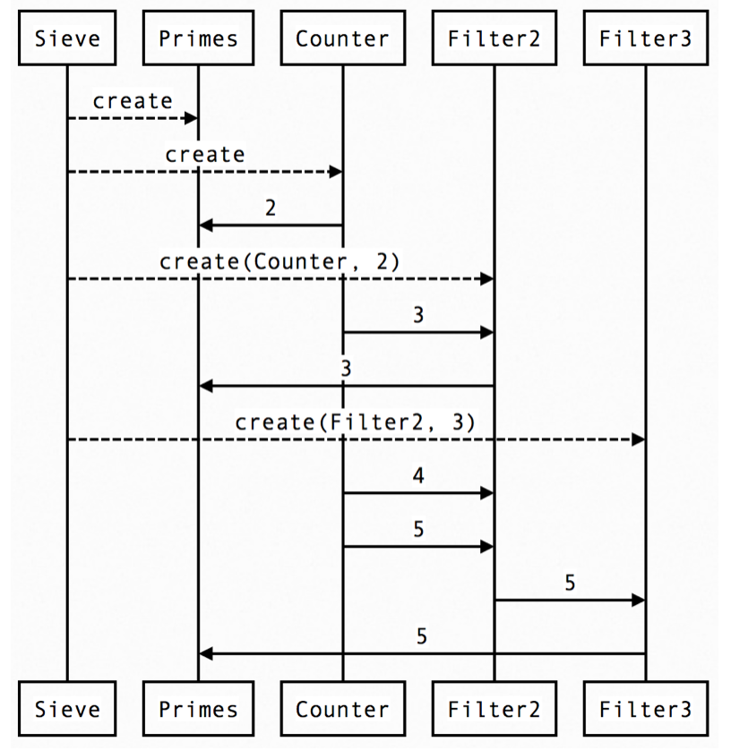

# Demo Programs for NEPLS'15

This repo contains demos for my talk **Session Types in ATS** for [NEPLS'15](http://www.nepls.org/Events/28/). 

## Abstract 

Session types offer a type-based discipline for enforcing that communication protocols be correctly followed in distributed programming. In essence, a session type can be assigned to a channel that encodes the protocol in use for communication on the channel and any code that uses the channel must follow the protocol precisely for otherwise the code cannot pass type checking.

In this talk, we are to show that session types can be readily implemented in ATS, a statically typed programming language equipped with dependent types (of DML-style) and linear types. One particular implementation of session types in ATS translates (session-typed) ATS programs into Erlang code, benefiting directly from Erlang's extensive support for distributed programming. Interesting examples will be given to demonstrate certain usage and benefits of session types.

## Code

All the codes implement the classic Sieve of Eratosthenes using channels. A `counter` constantly send natural numbers to a channel, a `filter` read in numbers from one channel and send out filtered numbers to an output channel. And through careful computation, `primes` gather all prime numbers and output them to yet another channel to end users.

1. `untyped.dats` contains an untyped implementation of sessions, or basically a naive π-calculus. It is actually a simple implementation of [CML](http://cml.cs.uchicago.edu). There isn't any guarantee and you can easily deadlock if not careful.
2. `simplesession.dats` contains a session typed version. The type of channels strictly enforces the correct usage of a channel. Send/receive has to be in correct order and match each other. But this one is simply generating prime numbers forever and not terminating.
3. `session.dats` is an even stronger version which supports a choice between continuing prime number or closing a session at each iteration. Therefore, you can elegantly close all channels in the end and it is guaranteed not to leak any process in Erlang.

## Runtime Requirement

You need to install [ATS](www.ats-lang.org), [Erlang](http://erlang.org) and [Elixir](http://elixir-lang.org) in order to run this.

Instructions for installing ATS can be found [here](http://www.ats-lang.org/Downloads.html) and note that `ats-contrib` is required. 

## Related Links

1. ATS official site: http://ats-lang.org
2. ATS repo on Github: http://github.com/githwxi/ATS-Postiats
3. ATS Contrib repo on Github: http://github.com/githwxi/ATS-Postiats-contrib
4. ATS User Group: https://groups.google.com/forum/#!forum/ats-lang-users
5. Author of ATS: Hongwei Xi http://www.cs.bu.edu/~hwxi/
